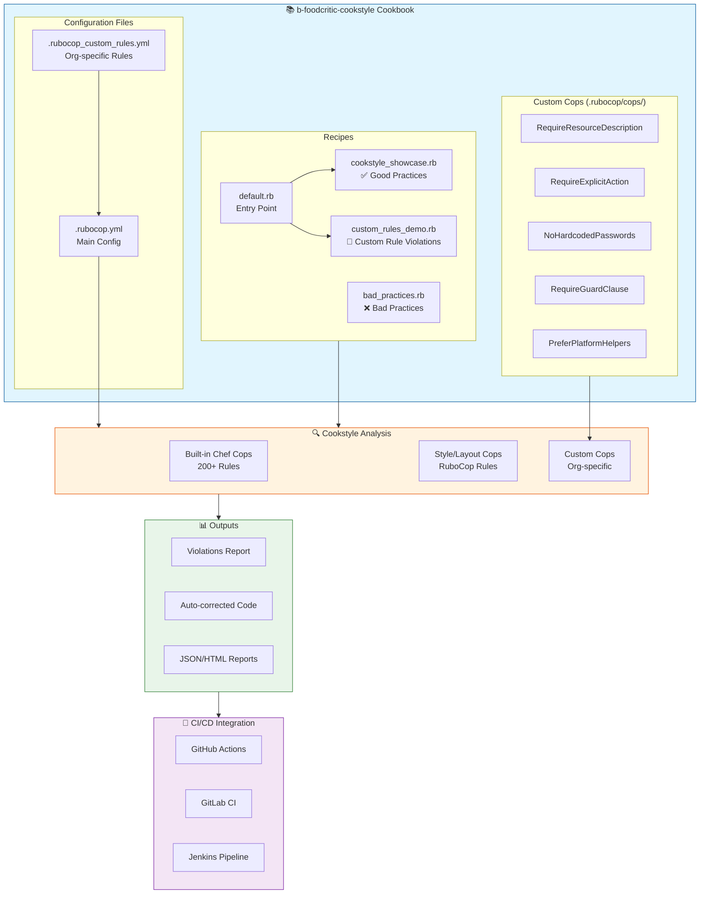
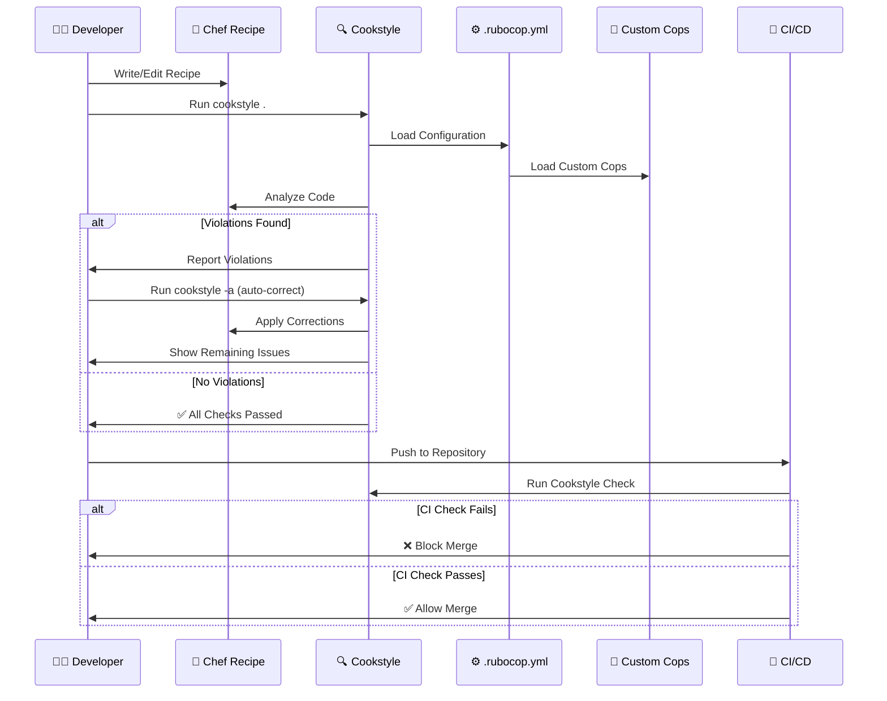
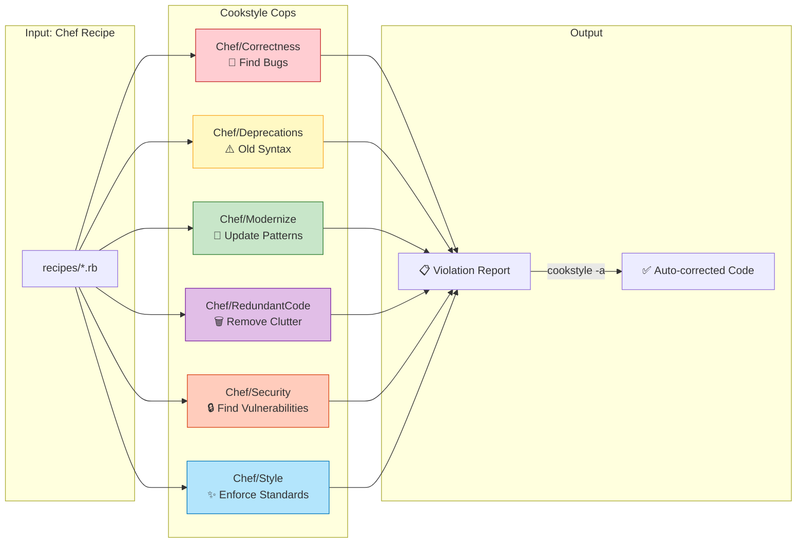

# b-foodcritic-cookstyle Cookbook

A comprehensive demonstration cookbook showcasing **Cookstyle** capabilities, including built-in cops, custom rule implementation, and best practices for Chef Infra cookbook development.

## Table of Contents

- [Overview](#overview)
- [Purpose](#purpose)
- [Prerequisites](#prerequisites)
- [Cookbook Structure](#cookbook-structure)
- [What is Cookstyle?](#what-is-cookstyle)
- [Recipes](#recipes)
- [Running Cookstyle](#running-cookstyle)
- [Expected Outcomes](#expected-outcomes)
- [Custom Cookstyle Rules](#custom-cookstyle-rules)
- [Configuration Files](#configuration-files)
- [Migrating from Foodcritic](#migrating-from-foodcritic)
- [CI/CD Integration](#cicd-integration)
- [Best Practices](#best-practices)
- [Troubleshooting](#troubleshooting)

---

## Overview

This cookbook serves as a **learning resource and reference implementation** for teams adopting Cookstyle as their Chef cookbook linting tool. It demonstrates:

1. ✅ **Good coding practices** that pass Cookstyle checks
2. ❌ **Bad practices** that trigger Cookstyle violations
3. 🔧 **Custom cop implementation** for organization-specific rules
4. 📋 **Configuration management** for Cookstyle rules

## Purpose

The primary goals of this cookbook are:

| Goal | Description |
|------|-------------|
| **Education** | Teach developers what Cookstyle checks for and why |
| **Demonstration** | Show real-world examples of violations and fixes |
| **Custom Rules** | Provide templates for creating organization-specific cops |
| **Migration Guide** | Help teams transition from deprecated Foodcritic |
| **CI/CD Ready** | Provide examples for pipeline integration |

## High-Level Flow



### Flow Description

1. **Cookbook Structure** → Contains recipes demonstrating good/bad practices and custom rule violations
2. **Configuration** → `.rubocop.yml` defines which cops to enable and their settings
3. **Custom Cops** → Organization-specific rules in `.rubocop/cops/` extend Cookstyle
4. **Cookstyle Analysis** → Runs built-in Chef cops + custom cops against recipes
5. **Output** → Generates violation reports, auto-corrects code, produces CI-friendly reports
6. **CI/CD** → Integrates with GitHub Actions, GitLab CI, or Jenkins for automated checking



### Cookstyle Cop Categories Flow



## Prerequisites

Before using this cookbook, ensure you have:

- **Chef Workstation** >= 21.0 (includes Cookstyle)
- **Ruby** >= 3.0 (for custom cops development)
- **Git** for version control

```bash
# Verify Cookstyle is installed
cookstyle --version

# Expected output: Cookstyle X.X.X (RuboCop X.X.X)
```

## Cookbook Structure

```
b-foodcritic-cookstyle/
├── .rubocop.yml                     # Main Cookstyle configuration
├── .rubocop_custom_rules.yml        # Organization-specific overrides
├── .rubocop/
│   └── cops/
│       └── custom_cops.rb           # Custom cop implementations (5 cops)
├── recipes/
│   ├── default.rb                   # Entry point - includes other recipes
│   ├── cookstyle_showcase.rb        # ✅ GOOD practices (10 examples)
│   ├── bad_practices.rb             # ❌ BAD practices (14 violations)
│   └── custom_rules_demo.rb         # 🔧 Custom rule violations
├── templates/
│   ├── config.conf.erb              # Sample template file
│   └── test.erb                     # Test template
├── metadata.rb                      # Cookbook metadata
└── README.md                        # This file
```

## What is Cookstyle?

Cookstyle is a code linting tool based on RuboCop that provides Chef-specific cops (rules) for enforcing coding standards in Chef cookbooks. It replaces the deprecated Foodcritic tool.

### Key Features

| Feature | Description |
|---------|-------------|
| **Chef-Specific Cops** | 200+ rules specifically for Chef code |
| **Auto-Correction** | Automatically fix many violations |
| **Deprecation Detection** | Find deprecated Chef syntax before upgrades |
| **Security Checks** | Identify potential security issues |
| **Style Enforcement** | Maintain consistent code style |
| **Extensible** | Create custom cops for your organization |

### Cop Categories

Cookstyle organizes cops into categories:

| Category | Purpose |
|----------|---------|
| `Chef/Correctness` | Code that will cause errors or unexpected behavior |
| `Chef/Deprecations` | Deprecated Chef features that will be removed |
| `Chef/Modernize` | Outdated patterns that have better alternatives |
| `Chef/RedundantCode` | Unnecessary code that can be removed |
| `Chef/Security` | Security vulnerabilities and concerns |
| `Chef/Style` | Code style and convention issues |
| `Chef/Sharing` | Issues for cookbooks shared on Supermarket |

## Recipes

### default.rb
The entry point recipe that includes other demonstration recipes.

```ruby
include_recipe 'b-foodcritic-cookstyle::cookstyle_showcase'
include_recipe 'b-foodcritic-cookstyle::custom_rules_demo'
```

### cookstyle_showcase.rb
Demonstrates **GOOD practices** that pass Cookstyle checks:

| Example | Description |
|---------|-------------|
| Modern Resource Syntax | Using `action` as a property |
| Service Resource | Proper service configuration with supports |
| File Permissions | String mode format (`'0644'`) |
| Directory Resource | Recursive creation with proper ownership |
| Template Variables | Using variables hash properly |
| Execute Guards | `not_if` and `only_if` for idempotency |
| Node Attributes | Correct attribute access patterns |
| Platform Conditionals | Using `platform_family?` helpers |
| Ruby Blocks | Proper block syntax |
| Remote File | Downloading with guards |

### bad_practices.rb
Demonstrates **BAD practices** that Cookstyle will catch:

| Violation | Cop | Severity |
|-----------|-----|----------|
| Integer file modes (`mode 644`) | `Chef/Style/FileMode` | Refactor |
| Double quotes without interpolation | `Style/StringLiterals` | Convention |
| Redundant return statements | `Style/RedundantReturn` | Convention |
| `unless` with `else` | `Style/UnlessElse` | Convention |
| Lines > 120 characters | `Layout/LineLength` | Convention |
| Mixed tabs/spaces | `Layout/IndentationStyle` | Convention |
| Using `and`/`or` | `Style/AndOr` | Convention |
| Missing safe navigation | `Style/SafeNavigation` | Convention |
| Trailing whitespace | `Layout/TrailingWhitespace` | Convention |
| Unnecessary parentheses | Various | Convention |

### custom_rules_demo.rb
Demonstrates violations caught by **CUSTOM cops**:

| Violation | Custom Cop | Description |
|-----------|------------|-------------|
| No resource comment | `Custom::RequireResourceDescription` | Resources need documentation |
| No explicit action | `Custom::RequireExplicitAction` | Don't rely on defaults |
| Hardcoded password | `Custom::NoHardcodedPasswords` | Security vulnerability |
| Missing guard clause | `Custom::RequireGuardClause` | Idempotency required |
| Platform comparison | `Custom::PreferPlatformHelpers` | Use helper methods |

## Running Cookstyle

### Basic Commands

```bash
# Navigate to cookbook directory
cd cookbooks/b-foodcritic-cookstyle

# Run on entire cookbook
cookstyle .

# Run on specific recipe
cookstyle recipes/bad_practices.rb

# Run on multiple files
cookstyle recipes/bad_practices.rb recipes/custom_rules_demo.rb
```

### Auto-Correction

```bash
# Auto-correct all safe fixes
cookstyle -a .

# Auto-correct including unsafe fixes (review changes!)
cookstyle -A .

# Preview what would be corrected
cookstyle --auto-correct-all --dry-run .
```

### Output Formats

```bash
# Default format (progress)
cookstyle .

# JSON format (for CI/CD parsing)
cookstyle --format json -o cookstyle-results.json .

# HTML report (for human review)
cookstyle --format html -o cookstyle-report.html .

# Multiple formats simultaneously
cookstyle --format progress --format json -o results.json .

# Quiet mode (only show offenses)
cookstyle --format quiet .
```

### Filtering Cops

```bash
# Show all available cops
cookstyle --show-cops

# Show only Chef-specific cops
cookstyle --show-cops | grep "Chef/"

# Run only specific cops
cookstyle --only Chef/Style/FileMode .

# Exclude specific cops
cookstyle --except Layout/LineLength .

# Run only Chef cops
cookstyle --only-guide-cops Chef .
```

## Expected Outcomes

### Running on bad_practices.rb

```bash
$ cookstyle recipes/bad_practices.rb
```

**Expected Output:**
```
Inspecting 1 file
W

Offenses:

recipes/bad_practices.rb:31:8: R: Chef/Style/FileMode: Use strings to represent file modes
  mode 644  # BAD: Should be '0644' as a string
       ^^^
recipes/bad_practices.rb:48:9: C: Style/StringLiterals: Prefer single-quoted strings
package "vim" do
        ^^^^^
... (20+ more offenses)

1 file inspected, 24 offenses detected, 20 offenses auto-correctable
```

### Running on cookstyle_showcase.rb

```bash
$ cookstyle recipes/cookstyle_showcase.rb
```

**Expected Output:**
```
Inspecting 1 file
R

Offenses:
recipes/cookstyle_showcase.rb:95:13: R: Chef/Style/UsePlatformHelpers: Use platform? helpers
... (minimal violations - mostly suggestions)

1 file inspected, 3 offenses detected, 2 offenses auto-correctable
```

### Running on Entire Cookbook

```bash
$ cookstyle .
```

**Expected Output:**
```
Inspecting 7 files
.WWRW..

7 files inspected, 32 offenses detected, 26 offenses auto-correctable
```

### After Auto-Correction

```bash
$ cookstyle -a .
$ cookstyle .
```

**Expected Output:**
```
Inspecting 7 files
.......

7 files inspected, no offenses detected
```

## Custom Cookstyle Rules

This cookbook includes **5 custom Cookstyle cops** in `.rubocop/cops/custom_cops.rb`:

### Custom::RequireResourceDescription

**Purpose:** Ensures all Chef resources have descriptive comments above them.

```ruby
# ❌ BAD - No comment
package 'nginx' do
  action :install
end

# ✅ GOOD - Has descriptive comment
# Install nginx web server for reverse proxy
package 'nginx' do
  action :install
end
```

### Custom::RequireExplicitAction

**Purpose:** Ensures all resources have explicit actions defined (don't rely on defaults).

```ruby
# ❌ BAD - Relies on default action
package 'nginx' do
end

# ✅ GOOD - Explicit action
package 'nginx' do
  action :install
end
```

### Custom::NoHardcodedPasswords

**Purpose:** Detects hardcoded passwords and secrets in resources.

```ruby
# ❌ BAD - Hardcoded password
user 'deploy' do
  password 'secret123'
end

# ✅ GOOD - Use data bags or vault
user 'deploy' do
  password data_bag_item('users', 'deploy')['password']
end
```

### Custom::RequireGuardClause

**Purpose:** Ensures execute/bash/script resources have guard clauses for idempotency.

```ruby
# ❌ BAD - No guard (not idempotent)
execute 'install-app' do
  command './install.sh'
end

# ✅ GOOD - Has guard clause
execute 'install-app' do
  command './install.sh'
  not_if { File.exist?('/opt/app/installed') }
end
```

### Custom::PreferPlatformHelpers

**Purpose:** Encourages using platform helpers instead of direct attribute comparison.

```ruby
# ❌ BAD - Direct comparison
if node['platform'] == 'ubuntu'

# ✅ GOOD - Platform helper
if platform?('ubuntu')
```

### Implementing Custom Cops

To create your own custom cop:

1. Create a Ruby file in `.rubocop/cops/`
2. Inherit from `RuboCop::Cop::Base`
3. Define the `MSG` constant for the offense message
4. Implement `on_send`, `on_block`, or other AST node methods
5. Add to `.rubocop.yml` using `require`

```ruby
# .rubocop/cops/my_cop.rb
module RuboCop
  module Cop
    module Custom
      class MyCop < Base
        MSG = 'Description of the violation'

        def on_send(node)
          # Check node and add_offense if violation found
          add_offense(node) if violation?(node)
        end
      end
    end
  end
end
```

## Configuration Files

### .rubocop.yml

Main Cookstyle configuration file:

```yaml
# Key configurations
AllCops:
  TargetRubyVersion: 3.1
  Include:
    - '**/*.rb'
  Exclude:
    - 'vendor/**/*'

# Enable Chef cops
Chef/Modernize:
  Enabled: true
Chef/Deprecations:
  Enabled: true

# Layout settings
Layout/LineLength:
  Max: 120

# Style settings
Style/StringLiterals:
  EnforcedStyle: single_quotes
```

### .rubocop_custom_rules.yml

Organization-specific rule overrides for company policies.

## Migrating from Foodcritic

If you're migrating from Foodcritic, here's the mapping:

| Foodcritic Rule | Cookstyle Equivalent |
|-----------------|---------------------|
| FC001 | Chef/Deprecations/* |
| FC002 | Chef/Correctness/ConditionalRubyShellout |
| FC003 | Chef/Correctness/InvalidPlatformMetadata |
| FC004 | Chef/Modernize/UseRequireRelative |
| FC005 | Chef/RedundantCode/CustomResourceWithAllowedActions |
| FC006 | Chef/Style/FileMode |
| FC007 | Chef/Correctness/ResourceWithNoneAction |
| FC008 | Chef/Style/UnnecessaryPlatformCaseStatement |
| FC009 | Chef/Correctness/ResourceWithNothingAction |
| FC010 | Chef/Correctness/InvalidSearchQuerySyntax |
| ... | Chef/* (various) |

### Migration Steps

1. **Remove Foodcritic** from your CI/CD pipeline
2. **Install Cookstyle** (included in Chef Workstation)
3. **Run initial scan**: `cookstyle . --format json -o baseline.json`
4. **Create `.rubocop.yml`** with your configuration
5. **Fix violations gradually** or use auto-correct
6. **Add Cookstyle to CI/CD** as a required check

## CI/CD Integration

### GitHub Actions

```yaml
# .github/workflows/cookstyle.yml
name: Cookstyle
on: [push, pull_request]

jobs:
  cookstyle:
    runs-on: ubuntu-latest
    steps:
      - uses: actions/checkout@v3
      - name: Install Chef Workstation
        uses: actionshub/chef-install@main
      - name: Run Cookstyle
        run: cookstyle --format progress --format json -o cookstyle.json .
      - name: Upload Report
        uses: actions/upload-artifact@v3
        with:
          name: cookstyle-report
          path: cookstyle.json
```

### GitLab CI

```yaml
# .gitlab-ci.yml
cookstyle:
  image: chef/chefworkstation
  script:
    - cookstyle --format progress .
  allow_failure: false
```

### Jenkins Pipeline

```groovy
pipeline {
    agent any
    stages {
        stage('Lint') {
            steps {
                sh 'cookstyle --format progress --format junit -o cookstyle.xml .'
            }
            post {
                always {
                    junit 'cookstyle.xml'
                }
            }
        }
    }
}
```

## Best Practices

### 1. Run Cookstyle Early and Often

```bash
# Add to pre-commit hook
#!/bin/bash
cookstyle --format quiet .
```

### 2. Use Auto-Correct Wisely

```bash
# Safe auto-correct first
cookstyle -a .

# Review changes before committing
git diff

# Then unsafe corrections if needed
cookstyle -A .
```

### 3. Document Exceptions

```ruby
# When you must disable a cop, document why
# rubocop:disable Chef/Deprecations/DeprecatedYumRepositoryProperties
# Reason: Legacy system requires deprecated property until migration
yum_repository 'epel' do
  mirrorlist 'http://...'  # deprecated but required
end
# rubocop:enable Chef/Deprecations/DeprecatedYumRepositoryProperties
```

### 4. Gradual Adoption

For large existing cookbooks:

```yaml
# .rubocop.yml - Start with warnings only
AllCops:
  NewCops: disable

# Enable cops gradually
Chef/Style/FileMode:
  Severity: warning  # Start as warning, then error
```

### 5. Team Configuration

Share configuration across cookbooks:

```yaml
# .rubocop.yml
inherit_from:
  - https://raw.githubusercontent.com/org/standards/main/.rubocop.yml
```

## Troubleshooting

### Common Issues

**Issue: "Unknown cop" error**
```
Error: unrecognized cop Chef/Something found
```
**Solution:** Update Chef Workstation to latest version

**Issue: Too many violations**
```bash
# Generate todo file to temporarily ignore existing violations
cookstyle --auto-gen-config
# This creates .rubocop_todo.yml
```

**Issue: Slow performance on large cookbooks**
```yaml
# .rubocop.yml - Exclude generated/vendor files
AllCops:
  Exclude:
    - 'vendor/**/*'
    - 'berks-cookbooks/**/*'
```

### Getting Help

```bash
# Show documentation for a specific cop
cookstyle --show-docs Chef/Style/FileMode

# Verbose output for debugging
cookstyle --debug .
```

## License

Apache-2.0

## Author

Chef Infra Team

## Contributing

1. Fork the repository
2. Create a feature branch
3. Run `cookstyle -a .` to ensure code passes
4. Submit a pull request

---

**Note:** This cookbook is for **educational purposes**. The `bad_practices.rb` recipe intentionally contains violations and should not be used in production environments.

Chef Infra Team
