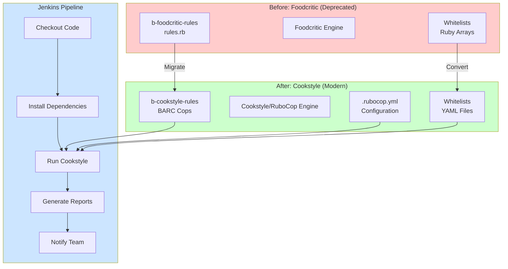
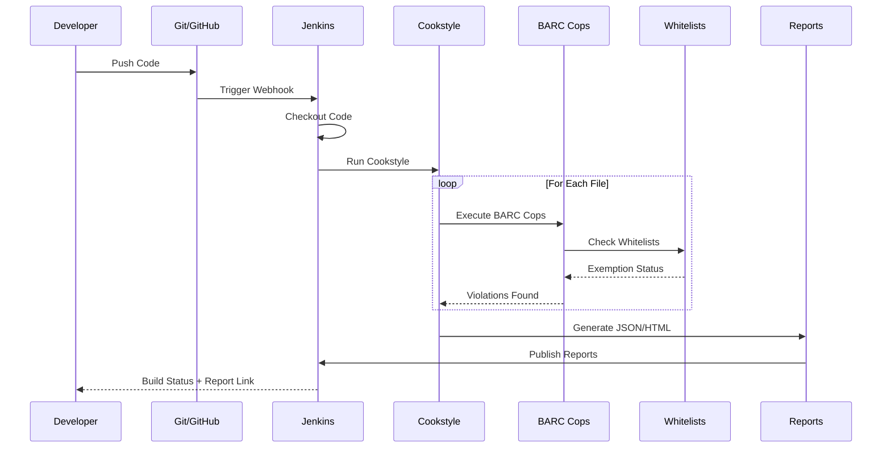
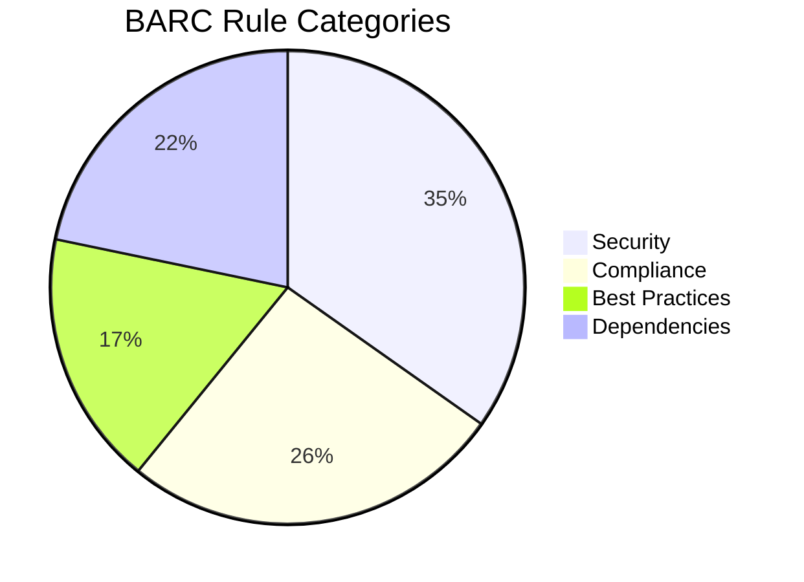

# Foodcritic to Cookstyle Migration POC

## Overview

This POC demonstrates how to migrate your organization's custom Foodcritic rules (b-foodcritic-rules) to Cookstyle custom cops, with Jenkins CI/CD integration.

## Migration Architecture

```
┌─────────────────────────────────────────────────────────────────────────────┐
│                        BEFORE (Foodcritic - Deprecated)                      │
├─────────────────────────────────────────────────────────────────────────────┤
│  Developer Push → Jenkins → Foodcritic + b-foodcritic-rules → Pass/Fail    │
│                                                                              │
│  Components:                                                                 │
│  - b-foodcritic-rules/rules.rb (Custom BARC001-BARC035 rules)               │
│  - Whitelists: services, /etc files, commands, cookbooks                    │
└─────────────────────────────────────────────────────────────────────────────┘
                                    ↓
                            MIGRATION
                                    ↓
┌─────────────────────────────────────────────────────────────────────────────┐
│                        AFTER (Cookstyle - Modern)                            │
├─────────────────────────────────────────────────────────────────────────────┤
│  Developer Push → Jenkins → Cookstyle + b-cookstyle-rules → Pass/Fail      │
│                                                                              │
│  Components:                                                                 │
│  - b-cookstyle-rules/ (Ruby gem with custom cops)                           │
│    ├── lib/rubocop/cop/barclays/*.rb (BARC001-BARC035 cops)                │
│    ├── config/default.yml (Cop configurations)                              │
│    └── data/*.yml (Whitelists as YAML)                                      │
│  - Cookstyle built-in Chef cops (200+ rules)                                │
└─────────────────────────────────────────────────────────────────────────────┘
```

## Directory Structure

```
cookstyle-migration-poc/
├── b-cookstyle-rules/                    # Custom Cookstyle cops gem
│   ├── lib/
│   │   ├── b_cookstyle_rules.rb          # Main entry point
│   │   └── rubocop/
│   │       └── cop/
│   │           └── barclays/             # BARC* cops
│   │               ├── barc001_no_local_users.rb
│   │               ├── barc002_no_local_groups.rb
│   │               ├── barc003_no_root_ssh.rb
│   │               ├── barc005_etc_blacklist.rb
│   │               ├── barc009_no_firewall.rb
│   │               └── ... (more cops)
│   ├── config/
│   │   └── default.yml                   # Default cop configuration
│   ├── data/
│   │   ├── whitelists.yml                # Service/command whitelists
│   │   ├── etc_blacklist.yml             # /etc file restrictions
│   │   └── cookbook_whitelists.yml       # Cookbook exemptions
│   ├── b_cookstyle_rules.gemspec
│   └── Gemfile
├── sample-cookbook/                       # Test cookbook
│   ├── recipes/
│   │   ├── compliant.rb                  # Passes all checks
│   │   └── violating.rb                  # Fails checks
│   └── .rubocop.yml                      # References custom cops
├── jenkins/
│   ├── Jenkinsfile                       # Pipeline definition
│   └── cookstyle-wrapper.sh              # Wrapper script
└── README.md                             # This file
```

## Foodcritic to Cookstyle Rule Mapping

| Foodcritic Rule | Cookstyle Cop | Description |
|-----------------|---------------|-------------|
| BARC001 | Barclays/NoLocalUsers | Do not manipulate users locally |
| BARC002 | Barclays/NoLocalGroups | Do not manipulate groups locally |
| BARC003 | Barclays/NoRootSsh | Do not manipulate .ssh for root |
| BARC004 | Barclays/NoSshKeys | Avoid manipulating ssh keys |
| BARC005 | Barclays/EtcBlacklist | Do not manipulate blacklisted /etc files |
| BARC005a | Barclays/EtcBlacklistAttributes | Check attributes for /etc files |
| BARC006 | Barclays/NoReboot | Do not reboot nodes |
| BARC007 | Barclays/NoSelinux | Do not manipulate SELinux |
| BARC008 | Barclays/NoKillProcess | Do not kill processes |
| BARC009 | Barclays/NoFirewall | Do not manipulate firewalls |
| BARC010 | Barclays/NoInit | Do not use init/telinit |
| BARC011 | Barclays/NoRemoveFiles | Do not remove files |
| BARC012 | Barclays/NoKernel | Do not manipulate kernel |
| BARC013 | Barclays/NoFilesystem | Do not manipulate filesystem |
| BARC014 | Barclays/NoNetwork | Do not manipulate network |
| BARC015 | Barclays/NoRootCron | Do not manipulate root cron |
| BARC016 | Barclays/UseChefResources | Use Chef resources, not commands |
| BARC017 | Barclays/NoSystemServices | Do not manipulate system services |
| BARC018 | Barclays/ReviewService | Review unapproved services |
| BARC019 | Barclays/NoFindSudo | Do not use find/sudo |
| BARC020 | Barclays/NoMiscCommands | Do not use fuser/setfacl/wall |
| BARC021 | Barclays/ExactVersion | Specify exact cookbook versions |
| BARC027 | Barclays/MiddlewarePackages | Restrict middleware packages |
| BARC028 | Barclays/RestrictedCookbooks | Restrict certain cookbooks |
| BARC030 | Barclays/DeprecatedCookbooks | Prevent deprecated cookbooks |
| BARC031 | Barclays/ControlledPackages | Restrict controlled packages |

## Quick Start

### 1. Install Custom Cops

```bash
cd b-cookstyle-rules
gem build b_cookstyle_rules.gemspec
gem install b_cookstyle_rules-*.gem
```

### 2. Configure Cookbook

Add to your cookbook's `.rubocop.yml`:

```yaml
require:
  - b_cookstyle_rules

# Enable all Barclays cops
Barclays:
  Enabled: true
```

### 3. Run Cookstyle

```bash
cd your-cookbook
cookstyle .
```

### 4. Jenkins Integration

Use the provided `Jenkinsfile`:

```groovy
pipeline {
    agent any
    stages {
        stage('Lint') {
            steps {
                sh './jenkins/cookstyle-wrapper.sh'
            }
        }
    }
}
```

## Migration Benefits

| Aspect | Foodcritic | Cookstyle |
|--------|------------|-----------|
| **Status** | ❌ Deprecated | ✅ Actively maintained |
| **Chef Compatibility** | Chef 14 and below | Chef 15+ |
| **Auto-correction** | ❌ No | ✅ Yes |
| **RuboCop Integration** | ❌ No | ✅ Yes |
| **IDE Support** | Limited | Full (VS Code, etc.) |
| **Custom Rules** | Ruby DSL | RuboCop Cop API |
| **Output Formats** | Text | JSON, HTML, JUnit |

## Next Steps

1. Review converted cops in `b-cookstyle-rules/`
2. Test against sample cookbooks
3. Integrate with Jenkins pipeline
4. Roll out to development teams
## Architecture Diagrams

### High-Level Migration Flow



### Cop Execution Flow



### BARC Cop Categories



## File Structure Details

```
cookstyle-migration-poc/
├── README.md                              # This documentation
│
├── b-cookstyle-rules/                     # Ruby Gem for Custom Cops
│   ├── Gemfile                            # Gem dependencies
│   ├── b_cookstyle_rules.gemspec          # Gem specification
│   │
│   ├── lib/
│   │   ├── b_cookstyle_rules.rb           # Main entry point, loads all cops
│   │   │
│   │   ├── config/
│   │   │   └── default.yml                # Default cop configurations
│   │   │
│   │   ├── data/                          # YAML whitelist files
│   │   │   ├── platform_cookbooks.yml     # Exempt infrastructure cookbooks
│   │   │   ├── services.yml               # Service-to-cookbook mappings
│   │   │   └── etc_whitelist.yml          # /etc path exemptions
│   │   │
│   │   └── rubocop/cop/barclays/          # BARC Cop implementations
│   │       ├── base.rb                    # Base class with shared matchers
│   │       ├── barc001_no_local_users.rb  # No user resource/commands
│   │       ├── barc002_no_local_groups.rb # No group resource/commands
│   │       ├── barc003_no_root_ssh.rb     # No root .ssh manipulation
│   │       ├── barc005_etc_blacklist.rb   # /etc file restrictions
│   │       ├── barc006_no_reboot.rb       # No reboot/shutdown
│   │       ├── barc007_no_selinux.rb      # No SELinux changes
│   │       ├── barc008_no_kill_process.rb # No kill/renice commands
│   │       ├── barc009_no_firewall.rb     # No firewall changes
│   │       ├── barc011_no_remove_files.rb # No rm -rf patterns
│   │       ├── barc016_use_chef_resources.rb # Prefer Chef resources
│   │       ├── barc017_no_system_services.rb # Protected services
│   │       └── barc019_no_find_sudo.rb    # No dangerous find/sudo
│
├── test-cookbook/                         # Sample cookbook for testing
│   ├── metadata.rb                        # Cookbook metadata
│   └── recipes/
│       ├── default.rb                     # Default recipe (compliant)
│       ├── compliant.rb                   # All patterns pass
│       └── violations.rb                  # Intentional violations
│
├── config/
│   └── rubocop-example.yml                # Example .rubocop.yml config
│
└── jenkins/
    ├── Jenkinsfile                        # Jenkins pipeline definition
    └── cookstyle-wrapper.sh               # Shell wrapper for CI/CD
```

## Whitelist Configuration

### Platform Cookbooks
Infrastructure/platform cookbooks that are exempt from certain rules:

```yaml
# lib/data/platform_cookbooks.yml
cookbooks:
  - b-platform-base
  - b-platform-security
  - b-sshd
  - b-crowdstrike
  # ... more
```

### Service Restrictions
Which cookbooks can manage which services:

```yaml
# lib/data/services.yml
per_cookbook:
  b-crowdstrike:
    - falcon-sensor
  b-splunk:
    - splunk
    - splunkforwarder
```

### /etc Path Restrictions
Which cookbooks can modify which /etc paths:

```yaml
# lib/data/etc_whitelist.yml
per_cookbook:
  b-sshd:
    - /etc/ssh/sshd_config
  b-rsyslog:
    - /etc/rsyslog.conf
    - /etc/rsyslog.d/
```

## Testing the POC

### Run Against Violations Recipe

```bash
cd cookstyle-migration-poc
bundle install
bundle exec cookstyle test-cookbook/recipes/violations.rb
```

Expected output: Multiple BARC violations detected.

### Run Against Compliant Recipe

```bash
bundle exec cookstyle test-cookbook/recipes/compliant.rb
```

Expected output: No BARC violations (may have style suggestions).

### Run All Tests

```bash
# Using wrapper script
chmod +x jenkins/cookstyle-wrapper.sh
./jenkins/cookstyle-wrapper.sh --format json --output report.json test-cookbook/
```

## CI/CD Integration Options

### Option 1: Jenkinsfile Pipeline
Use the provided `jenkins/Jenkinsfile` for full pipeline integration with:
- Parallel cookbook linting
- HTML/JSON reports
- Slack notifications
- GitHub status checks

### Option 2: Wrapper Script
Use `jenkins/cookstyle-wrapper.sh` for simpler integration:
```bash
./cookstyle-wrapper.sh --strict cookbooks/
```

### Option 3: Direct Cookstyle
Run Cookstyle directly with custom rules:
```bash
cookstyle --require b_cookstyle_rules .
```

## Migration Checklist

- [ ] Review all BARC rules in b-foodcritic-rules/rules.rb
- [ ] Map each rule to corresponding Cookstyle cop
- [ ] Convert Ruby array whitelists to YAML
- [ ] Test cops against existing cookbooks
- [ ] Update Jenkins pipeline configuration
- [ ] Publish b-cookstyle-rules gem to internal repository
- [ ] Update cookbook templates with new .rubocop.yml
- [ ] Communicate migration timeline to teams
- [ ] Deprecate Foodcritic checks in pipeline
- [ ] Monitor for false positives/negatives