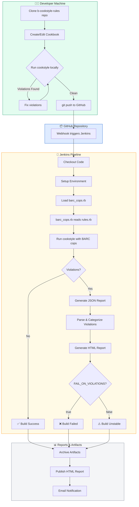
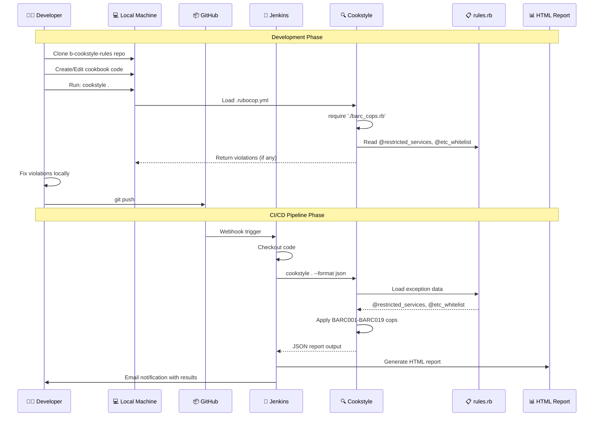
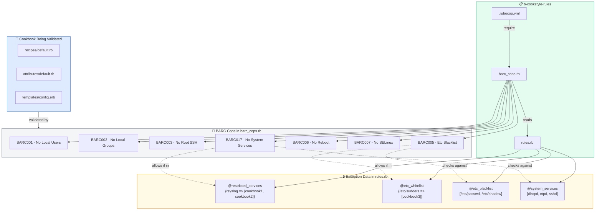

# 🔄 Cookstyle Workflow with Barclays Custom Cops

## Flow Diagram (Mermaid)

Copy and paste this into Confluence with the Mermaid macro or use [mermaid.live](https://mermaid.live) to generate an image.



---

## Detailed Process Flow



---

## Component Architecture



---

## ASCII Flow Diagram (Confluence Compatible)

```
┌─────────────────────────────────────────────────────────────────────────────────────────┐
│                           COOKSTYLE WORKFLOW WITH BARCLAYS COPS                          │
└─────────────────────────────────────────────────────────────────────────────────────────┘

╔═══════════════════════════════════════════════════════════════════════════════════════════╗
║  PHASE 1: LOCAL DEVELOPMENT                                                               ║
╠═══════════════════════════════════════════════════════════════════════════════════════════╣
║                                                                                           ║
║   👨‍💻 Developer Machine                                                                    ║
║   ┌─────────────────────────────────────────────────────────────────────────────────────┐ ║
║   │                                                                                     │ ║
║   │  ┌──────────────┐    ┌──────────────┐    ┌──────────────┐    ┌──────────────┐      │ ║
║   │  │   Clone      │───▶│   Create/    │───▶│    Run       │───▶│   Commit &   │      │ ║
║   │  │   Repo       │    │   Edit Code  │    │  cookstyle . │    │   Push       │      │ ║
║   │  └──────────────┘    └──────────────┘    └──────┬───────┘    └──────────────┘      │ ║
║   │                                                 │                                   │ ║
║   │                                                 ▼                                   │ ║
║   │                                          ┌────────────┐                             │ ║
║   │                                          │ Violations │──▶ Fix & Re-run             │ ║
║   │                                          │  Found?    │                             │ ║
║   │                                          └────────────┘                             │ ║
║   │                                                                                     │ ║
║   └─────────────────────────────────────────────────────────────────────────────────────┘ ║
║                                                                                           ║
║   📋 What happens locally:                                                                ║
║   ┌─────────────────────────────────────────────────────────────────────────────────────┐ ║
║   │  $ cookstyle .                                                                      │ ║
║   │      │                                                                              │ ║
║   │      ├──▶ Reads .rubocop.yml                                                        │ ║
║   │      │        │                                                                     │ ║
║   │      │        └──▶ require: ./barc_cops.rb                                          │ ║
║   │      │                    │                                                         │ ║
║   │      │                    └──▶ BarcRulesData.load_rules! reads rules.rb             │ ║
║   │      │                              │                                               │ ║
║   │      │                              ├── @restricted_services                        │ ║
║   │      │                              ├── @etc_whitelist                              │ ║
║   │      │                              ├── @etc_blacklist                              │ ║
║   │      │                              └── @system_services                            │ ║
║   │      │                                                                              │ ║
║   │      └──▶ Applies BARC001-BARC019 cops to cookbook                                  │ ║
║   │                                                                                     │ ║
║   └─────────────────────────────────────────────────────────────────────────────────────┘ ║
╚═══════════════════════════════════════════════════════════════════════════════════════════╝
                                            │
                                            │ git push
                                            ▼
╔═══════════════════════════════════════════════════════════════════════════════════════════╗
║  PHASE 2: CI/CD PIPELINE                                                                  ║
╠═══════════════════════════════════════════════════════════════════════════════════════════╣
║                                                                                           ║
║   📦 GitHub                        🔧 Jenkins EC2                                         ║
║   ┌────────────────┐               ┌─────────────────────────────────────────────────────┐║
║   │                │   Webhook     │                                                     │║
║   │  Push Event    │──────────────▶│  ┌─────────┐  ┌─────────┐  ┌─────────┐  ┌─────────┐│║
║   │                │               │  │Checkout │─▶│ Setup   │─▶│ Load    │─▶│  Run    ││║
║   │  main branch   │               │  │ Code    │  │ Ruby    │  │ Cops    │  │Cookstyle││║
║   │                │               │  └─────────┘  └─────────┘  └─────────┘  └────┬────┘│║
║   └────────────────┘               │                                              │     │║
║                                    │                                              ▼     │║
║                                    │  ┌───────────────────────────────────────────────┐ │║
║                                    │  │  cookstyle . --format json --out report.json  │ │║
║                                    │  └───────────────────────────────────────────────┘ │║
║                                    │                          │                         │║
║                                    │                          ▼                         │║
║                                    │                   ┌────────────┐                   │║
║                                    │                   │ Violations │                   │║
║                                    │                   │   Found?   │                   │║
║                                    │                   └─────┬──────┘                   │║
║                                    │                         │                          │║
║                                    │            ┌────────────┴────────────┐             │║
║                                    │            ▼                         ▼             │║
║                                    │      ┌──────────┐             ┌──────────┐         │║
║                                    │      │   YES    │             │    NO    │         │║
║                                    │      └────┬─────┘             └────┬─────┘         │║
║                                    │           │                        │               │║
║                                    │           ▼                        ▼               │║
║                                    │    ┌─────────────┐          ┌─────────────┐        │║
║                                    │    │ Generate    │          │   ✅ Build  │        │║
║                                    │    │ HTML Report │          │   Success   │        │║
║                                    │    └──────┬──────┘          └─────────────┘        │║
║                                    │           │                                        │║
║                                    │           ▼                                        │║
║                                    │    ┌─────────────────┐                             │║
║                                    │    │FAIL_ON_VIOLATIONS│                            │║
║                                    │    └────────┬────────┘                             │║
║                                    │             │                                      │║
║                                    │      ┌──────┴──────┐                               │║
║                                    │      ▼             ▼                               │║
║                                    │  ┌────────┐   ┌────────┐                           │║
║                                    │  │ true:  │   │ false: │                           │║
║                                    │  │❌ FAIL │   │⚠️ WARN │                           │║
║                                    │  └────────┘   └────────┘                           │║
║                                    │                                                    │║
║                                    └─────────────────────────────────────────────────────┘║
╚═══════════════════════════════════════════════════════════════════════════════════════════╝
                                            │
                                            │
                                            ▼
╔═══════════════════════════════════════════════════════════════════════════════════════════╗
║  PHASE 3: REPORTS & NOTIFICATIONS                                                         ║
╠═══════════════════════════════════════════════════════════════════════════════════════════╣
║                                                                                           ║
║   📊 Jenkins Artifacts                                                                    ║
║   ┌─────────────────────────────────────────────────────────────────────────────────────┐ ║
║   │                                                                                     │ ║
║   │   ┌──────────────────┐    ┌──────────────────┐    ┌──────────────────┐             │ ║
║   │   │  Archive JSON    │───▶│  Publish HTML    │───▶│  Send Email      │             │ ║
║   │   │  Report          │    │  Report          │    │  Notification    │             │ ║
║   │   └──────────────────┘    └──────────────────┘    └──────────────────┘             │ ║
║   │                                                                                     │ ║
║   │   ┌─────────────────────────────────────────────────────────────────────────────┐  │ ║
║   │   │  HTML Report Contents:                                                       │  │ ║
║   │   │  ┌─────────────────────────────────────────────────────────────────────────┐│  │ ║
║   │   │  │  Summary:     15 violations found across 3 files                        ││  │ ║
║   │   │  │  ─────────────────────────────────────────────────────────────────────  ││  │ ║
║   │   │  │  BARC001:     2 violations (user resource found)                        ││  │ ║
║   │   │  │  BARC005:     5 violations (/etc/passwd modification)                   ││  │ ║
║   │   │  │  BARC017:     3 violations (system service management)                  ││  │ ║
║   │   │  │  ─────────────────────────────────────────────────────────────────────  ││  │ ║
║   │   │  │  Chef/Style:  5 warnings (built-in cookstyle rules)                     ││  │ ║
║   │   │  └─────────────────────────────────────────────────────────────────────────┘│  │ ║
║   │   └─────────────────────────────────────────────────────────────────────────────┘  │ ║
║   │                                                                                     │ ║
║   └─────────────────────────────────────────────────────────────────────────────────────┘ ║
╚═══════════════════════════════════════════════════════════════════════════════════════════╝
```

---

## Files Involved in the Workflow

```
┌─────────────────────────────────────────────────────────────────────────────────────┐
│                              FILE RELATIONSHIPS                                      │
└─────────────────────────────────────────────────────────────────────────────────────┘

b-cookstyle-rules/
│
├── .rubocop.yml ─────────────────────┐
│   │                                 │
│   │  require: ./barc_cops.rb  ◀─────┤
│   │                                 │
│   └─ Cop configurations             │
│      (enabled/disabled,             │
│       severity levels)              │
│                                     │
├── barc_cops.rb ◀────────────────────┘
│   │
│   ├── module BarcRulesData
│   │   │
│   │   ├── load_rules! ─────────────────────┐
│   │   │                                    │
│   │   ├── service_whitelisted?()           │
│   │   │                                    │
│   │   └── etc_path_whitelisted?()          │
│   │                                        │
│   └── Cop Classes                          │
│       ├── Barc001NoLocalUsers              │
│       ├── Barc002NoLocalGroups             │
│       ├── Barc003NoRootSsh                 │
│       ├── Barc005EtcBlacklist              │
│       ├── Barc006NoReboot                  │
│       ├── Barc007NoSelinux                 │
│       ├── Barc008NoKillProcess             │
│       ├── Barc009NoFirewall                │
│       ├── Barc011NoRemoveFiles             │
│       ├── Barc016UseChefResources          │
│       ├── Barc017NoSystemServices          │
│       └── Barc019NoFindSudo                │
│                                            │
│                                            ▼
├── rules.rb ─────────────────────────────────┐
│   │                                         │
│   │  2,800+ lines of exception data:        │
│   │                                         │
│   ├── @restricted_services = {              │
│   │     'rsyslog' => ['cookbook1', ...],    │
│   │     'docker'  => [],  # all allowed     │
│   │   }                                     │
│   │                                         │
│   ├── @etc_whitelist = {                    │
│   │     '/etc/sudoers' => ['cookbook2'],    │
│   │   }                                     │
│   │                                         │
│   ├── @etc_blacklist = [                    │
│   │     '/etc/passwd',                      │
│   │     '/etc/shadow',                      │
│   │   ]                                     │
│   │                                         │
│   └── @system_services = %w[                │
│         dhcpd ntpd sshd rsyslogd            │
│       ]                                     │
│                                             │
├── Rakefile ──────────── Pipeline tasks      │
│                                             │
├── spec/ ────────────── RSpec tests          │
│                                             │
└── Jenkinsfile ───────── Pipeline definition │
```

---

## Exception Logic Flow

```
┌─────────────────────────────────────────────────────────────────────────────────────┐
│                        EXCEPTION CHECKING LOGIC                                      │
└─────────────────────────────────────────────────────────────────────────────────────┘

                          ┌──────────────────────┐
                          │  Cookbook Resource   │
                          │  e.g., service 'ntp' │
                          └──────────┬───────────┘
                                     │
                                     ▼
                          ┌──────────────────────┐
                          │  BARC017 Cop Fires   │
                          │  "System service     │
                          │   management"        │
                          └──────────┬───────────┘
                                     │
                                     ▼
                    ┌────────────────────────────────────┐
                    │  Is 'ntp' in @system_services?     │
                    └────────────────┬───────────────────┘
                                     │
                      ┌──────────────┴──────────────┐
                      │                             │
                      ▼                             ▼
                 ┌─────────┐                  ┌─────────┐
                 │   NO    │                  │   YES   │
                 └────┬────┘                  └────┬────┘
                      │                            │
                      ▼                            ▼
               ┌────────────┐         ┌────────────────────────────┐
               │  ✅ PASS   │         │  Check @restricted_services│
               │  No issue  │         │  for exceptions            │
               └────────────┘         └─────────────┬──────────────┘
                                                    │
                                      ┌─────────────┴─────────────┐
                                      │                           │
                                      ▼                           ▼
                        ┌──────────────────────┐    ┌──────────────────────┐
                        │ Cookbook in allowed  │    │ Cookbook NOT in      │
                        │ list OR list empty   │    │ allowed list         │
                        └──────────┬───────────┘    └──────────┬───────────┘
                                   │                           │
                                   ▼                           ▼
                            ┌────────────┐              ┌────────────┐
                            │  ✅ PASS   │              │  ❌ FAIL   │
                            │  Exception │              │  Violation │
                            │  Applied   │              │  Reported  │
                            └────────────┘              └────────────┘


Example from rules.rb:
─────────────────────────────────────────────────────────────────────
@restricted_services = {
  'ntp' => ['is_platform_ntp_cookbook', 'is_base_config'],  # Only these allowed
  'docker' => [],  # Empty = ALL cookbooks allowed
}

Cookbook: my-app-cookbook trying to manage 'ntp' service
  → 'ntp' is in @restricted_services
  → 'my-app-cookbook' is NOT in allowed list ['is_platform_ntp_cookbook', 'is_base_config']
  → ❌ VIOLATION: BARC017 - Cannot manage system service 'ntp'

Cookbook: is_platform_ntp_cookbook trying to manage 'ntp' service
  → 'ntp' is in @restricted_services
  → 'is_platform_ntp_cookbook' IS in allowed list
  → ✅ PASS: Exception applied (CHG ticket approved)
```

---

## Quick Reference Commands

| Environment | Command | Purpose |
|-------------|---------|---------|
| **Local** | `cookstyle .` | Run all checks |
| **Local** | `cookstyle . --only Barclays` | Run only BARC cops |
| **Local** | `cookstyle . --autocorrect` | Auto-fix issues |
| **Jenkins** | `cookstyle . --format json --out report.json` | JSON for pipeline |
| **Debug** | `cookstyle . --debug` | Verbose output |

---

*Document Version: 1.0 | Last Updated: March 2026 | Author: Chef Platform Team*
